# Heritage Housing Issues

This is my 5th and final project for the Code Institute "Full Stack Developer" Diploma. 
Predictive Analytics is something which has always interested me and I have been very excited to reach this point in the course. I had longed to learn and practice these skills, as well as gain an understanding into a world which fascinates me. I present my [first ever dashboard,](https://heritagehouse.herokuapp.com/) but certainly not my last. 

---
# Table of Contents

Table of Contents

* [Dataset Content](#dataset-content)
* [Business Requirements](#business-requirements)
* [User Stories](#user-stories)
* [Rationale to map the business requirements to the Data Visualizations and ML tasks](#rationale-to-map-the-business-requirements-to-the-data-visualizations-and-ml-tasks) 
* [ML Business Case](#ml-business-case)
* [Hypothesis and how to validate?](#hypothesis-and-how-to-validate?)
* [Dashboard Design](#dashboard-design)
* [Bugs](#bugs)
* [Deployment](#deployment)  
* [Main Data Analysis and Machine Learning Libraries](#main-data-analysis-and-machine-learning-libraries) 
* [Credits](#credits)  

---
## Dataset Content
* The dataset is sourced from [Kaggle](https://www.kaggle.com/codeinstitute/housing-prices-data). 
We then created a fictitious user story where predictive analytics can be applied in a real project in the workplace. 

* The dataset has almost 1.5 thousand rows and represents housing records from Ames, Iowa; indicating house profile (Floor Area, Basement, Garage, Kitchen, Lot, Porch, Wood Deck, Year Built) and its respective sale price for houses built between 1872 and 2010.

|Variable|Meaning|Units|
|:----|:----|:----|
|1stFlrSF|First Floor square feet|334 - 4692|
|2ndFlrSF|Second-floor square feet|0 - 2065|
|BedroomAbvGr|Bedrooms above grade (does NOT include basement bedrooms)|0 - 8|
|BsmtExposure|Refers to walkout or garden level walls|Gd: Good Exposure; Av: Average Exposure; Mn: Minimum Exposure; No: No Exposure; None: No Basement|
|BsmtFinType1|Rating of basement finished area|GLQ: Good Living Quarters; ALQ: Average Living Quarters; BLQ: Below Average Living Quarters; Rec: Average Rec Room; LwQ: Low Quality; Unf: Unfinshed; None: No Basement|
|BsmtFinSF1|Type 1 finished square feet|0 - 5644|
|BsmtUnfSF|Unfinished square feet of basement area|0 - 2336|
|TotalBsmtSF|Total square feet of basement area|0 - 6110|
|GarageArea|Size of garage in square feet|0 - 1418|
|GarageFinish|Interior finish of the garage|Fin: Finished; RFn: Rough Finished; Unf: Unfinished; None: No Garage|
|GarageYrBlt|Year garage was built|1900 - 2010|
|GrLivArea|Above grade (ground) living area square feet|334 - 5642|
|KitchenQual|Kitchen quality|Ex: Excellent; Gd: Good; TA: Typical/Average; Fa: Fair; Po: Poor|
|LotArea| Lot size in square feet|1300 - 215245|
|LotFrontage| Linear feet of street connected to property|21 - 313|
|MasVnrArea|Masonry veneer area in square feet|0 - 1600|
|EnclosedPorch|Enclosed porch area in square feet|0 - 286|
|OpenPorchSF|Open porch area in square feet|0 - 547|
|OverallCond|Rates the overall condition of the house|10: Very Excellent; 9: Excellent; 8: Very Good; 7: Good; 6: Above Average; 5: Average; 4: Below Average; 3: Fair; 2: Poor; 1: Very Poor|
|OverallQual|Rates the overall material and finish of the house|10: Very Excellent; 9: Excellent; 8: Very Good; 7: Good; 6: Above Average; 5: Average; 4: Below Average; 3: Fair; 2: Poor; 1: Very Poor|
|WoodDeckSF|Wood deck area in square feet|0 - 736|
|YearBuilt|Original construction date|1872 - 2010|
|YearRemodAdd|Remodel date (same as construction date if no remodelling or additions)|1950 - 2010|
|SalePrice|Sale Price|34900 - 755000|

## Business Requirements
As a good friend, you are requested by your friend, who has received an inheritance from a deceased great-grandfather located in Ames, Iowa, to help in maximising the sales price for the inherited properties.

Although your friend has an excellent understanding of property prices in her own state and residential area, she fears that basing her estimates for property worth on her current knowledge might lead to inaccurate appraisals. What makes a house desirable and valuable where she comes from might not be the same in Ames, Iowa. She found a public dataset with house prices for Ames, Iowa, and will provide you with that.

1 - The client is interested in discovering how the house attributes correlate with the sale price. Therefore, the client expects data visualisations of the correlated variables against the sale price to show that.

2 - The client is interested in predicting the house sale price from her four inherited houses and any other house in Ames, Iowa.

## User Stories
I will use the following shorthand within the user stories to link each user story back to the business requirements:
BR1 - Business Requirement 1 
BR2 = Business Requirement 2 

* **Information gathering and data collection**

**As a Data Practitioner** I want to have access to the correct data so that I can conduct the analysis and execute a ML Pipeline. 

How: This will be done by fetching data from Kaggle using an API key. 

Satisfied: Data connected using Kaggle API

**BR1 AND BR2** - Data collection and cleaning notebook 

* **Data visualization, cleaning, and preparation**
**As a data Practioner** I want to have clean data so that I can work more effectively at providing more accurate information to the User. 
How: Use data cleaning methods on data. 
Satisfied: Use Arbitrary Imputer, Categorical Variable Imputer and Mean Median Imputer. 
**BR1 and BR2** - Data cleaning and feature engineering notebook 

**As a data Practioner** I want to use only data that is relevant so that I am creating a more effective model and more accurate outputs of information.  
How: Use feature engineering methods on data. 
Satisfied: Use Numerical transformers, Power, Yeo Johnson and smart Correlation. 
**BR1 and BR2** - Feature engineering notebook 

**As a data Practioner** I want to be able to present the data visually so that the User is able to understand the data better.
How: plots and graphs that present the data. 
Satisfied: Seaborn plots, Pearson and Spearman correlation studies as well as PPS correlation study. 
**BR1** - Sale price study notebook and Study app 

**As a User/Client** I want to be able to see visualisations of the data so that it is easier for me to understand it. 
How: Present plots and graphs on the Study page on the dashboard. 
Satisfied: Seaborn plots, Pearson and Spearman correlation studies as well as PPS correlation study. 
**BR1** - Study app 

* **Model training, optimization and validation**

**As a User/Client** I want to predict/estimate the sale price of any house in Ames, Iowa so that I can improve my knowledge of the housing market of the area. 
How: Create ML pipeline that targets the Sale price 
Satisfied: Create House price prediction tool and ML Pipeline 
**BR2** - ML predict app and predictor app

**As a User/Client** I want to predict/estimate the sale price of the houses I have inherited so that I can make decisions favourably regarding their value.
How: Create ML pipeline that targets the Sale price. 
Satisfied: Create House price prediction tool and ML Pipeline 
**BR2** - ML predict app and predictor app

* **Dashboard planning, designing, and development**

**As a client** I want run sale price predictions using attributes for any Ames, Iowa property so that I can predict the sale price of a property I may wish to purchase in the future
How: Create a tool that has widgets that can be interacted with by the user to manipulate the output. Must be linked to the ML pipeline to make reliable predictions
Satisfied: House price prediction tool on dashboard
**BR2** - Predictor app 

**As a User/Client** I want to know the hypotheses and how they were validated so that I can understand the data better.
Action Required: Make the hypothesis publicly available on the dashboard
Satisfied: Create a 'Project Hypothesis' page in the app 
**BR1** - Hypothesis app 

**As a User/Client** I want to easily navigate through a dashboard so that I can intuitively find the information that I am looking for
How: Create a simple that is easy to navigate and understand 
Satisfied: Streamlit dashboard with a ever-present menu on the side
**BR1 and BR2** Summary, sale price study, predictor, hypotheses and ML predict apps. 

* **Dashboard deployment and release**
**As a client** I want a live site so that I can access the house price estimator and view the ML pipeline so that I can make decisions regarding my houses. 
Action Required: Deploy site on Heroku
Satisfied: Having access to a deployed Dashboard. 
**BR1 & BR2** 

**As a data practioner** I want a live site on which to host the project so that the pipeline can be updated as and when improvements are made. 
Action Required: Redeploy to Heroku when updates are made. 
Satisfied: By creating and deploying the dashboard to Heroku.
**BR2**

## The rationale to map the business requirements to the Data Visualisations and ML tasks
* ### Business Requirement 1: Data Visualisation and Correlation Study 
- We will explore and inspect the data related to the houses.
- We will conduct a correlation study (Pearson and Spearman) to gain a better understanding of house the variables are correlated with the 'SalePrice'.
- We will be using plots to measure the 'most strongly correlated' variables against Sale Price to visualize insights.
- We will use the finding of these studies to validate the hypotheses.

* ### Business Requirement 2: Regression Pipeline 
- We want to predict the sale price of our clients 4 inherited homes and any other house in Ames, Iowa. 
- We want to build and train a regression model to predict the target variable which is the sale price. 
- We will feature engineer our model and fit hyperparameters to improve its performance. 
- We want to run regression evaluation to demonstrate the R2 Score and Mean Absolute Error.

## ML Business Case
### Regression Model - Unspervised - Uni-dimensional 

- Provide client with well-studied insights 

* We want to build an ML Model that will:
1. Predict the sale price of a house in Ames, Iowa as the client has requested. 
2. Estimate the 'SalePrice' of the client’s 4 inherited properties. 
- The target variable is the 'SalePrice' 

* We will also need to create a machine learning pipeline that will:
- Make prediction of house sale prices. 
- We will be training this machine based on the most important features (variables). 
- The R2 score of this model needs to be above 0.75 on both train and test set to be considered successful. Anything short of this would be considered a failure. 
- The predictions need to remain consistent at over a long period of time (9-12 months) where the house value prediction is close to sale price 70% of the time. 
- The output should remain as the 'SalePrice'. 

## Hypothesis and how to validate?

- Hypothesis 1 - The larger the square footage of the property the higher the price 
        * By studying correlations between the size of the property (in square footage) and the sale value, we will be able to observe if this variable is a factor that influences price. 

        - A correlation study will help with validating this. We will use relevant data visualisation tools here. 

- Hypothesis 2 - The more recent the property build, the higher the property sale price/value (null hypothesis)
        * We will study data regarding the house build data and observe whether it correlates with a higher house value. 
       
        - A correlation study will help with validating this. We will use relevant data visualisation tools here.

- Hypothesis 3 - The better the overall quality of the property, the higher the price
        * We will check whether a property that has been rated as having a higher "overall quality" will also be higher in value 
       
        - A correlation study will help with validating this. We will use relevant data visualisation tools here.

## Data Cleaning 
I used a spreadsheet to track how the data should be cleaned:

## Feature engineering 

I used a spreadsheet to track how the data should be feature engineered:

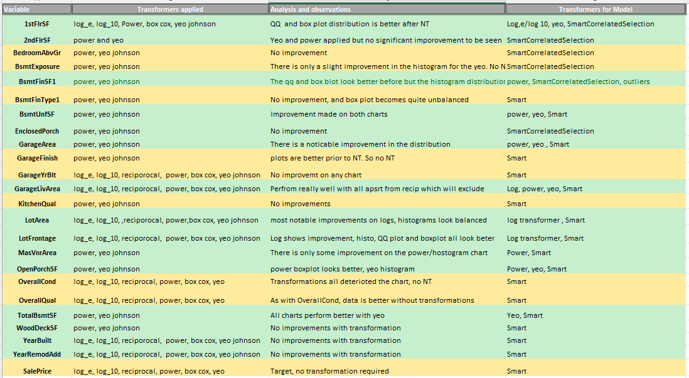

## Dashboard Design

### Page 1 
### Project Summary 
- Project 'Terms and Jargon’ are outlined alongside a story of how the project has come about. 
- Business Requirements are outlined. 
- Project Dataset is broadly described as well as its source. 

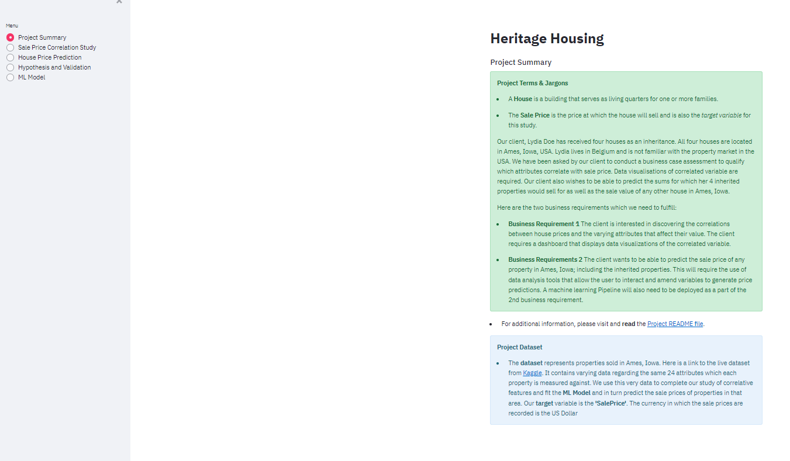

### Page 2
### Sale Price Correlation Study 

- This page answers business requirement 1: 

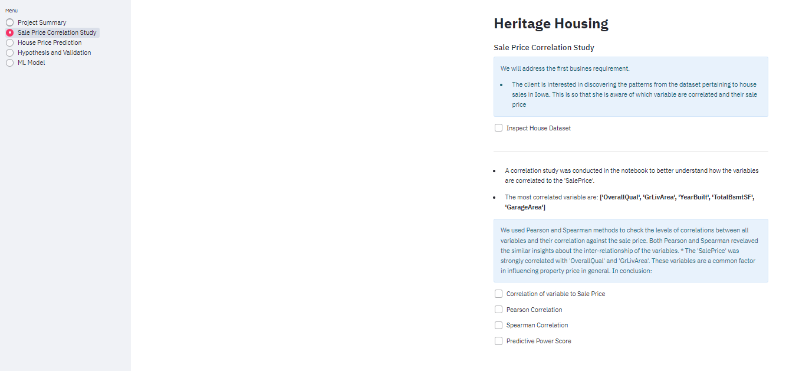

- The data set is available in the first instance to have a quick look over. 
- This page contains boxes which can be ticked using the mouse to reveal more data. This has been done to keep the outputs of the Sale_Price_study notebook contained until they need to be viewed.

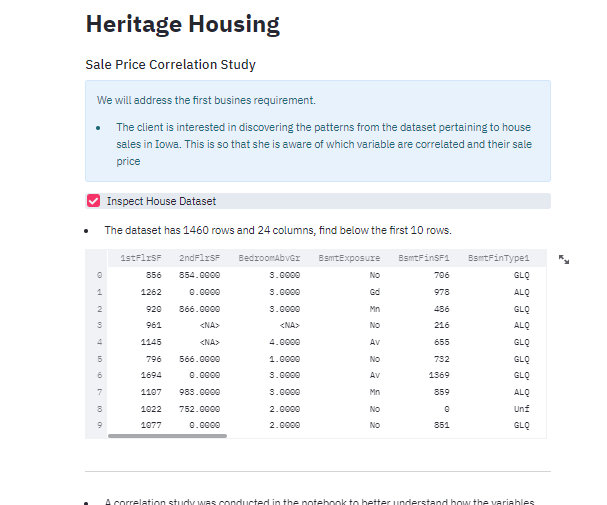

- The next 2 images show 5 plots that illustrate the data distribution to enable the visualisation to be easier for the client. 
- The plots show the 5 most important features of all the variables and how the correlate with the 'SalePrice' which is the 'Target Variable'. 
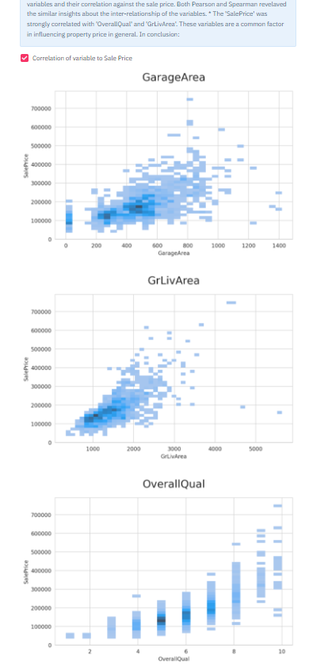
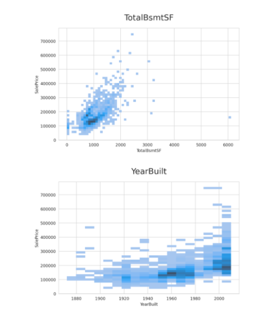

- Pearson Correlation, Spearman Correlation and Predictive Power Score show how the variables interact against one another and which variables correlate more positively with one another, as compared to other variables. This is all a part of providing useful insight to the client using data visualisation tools. 
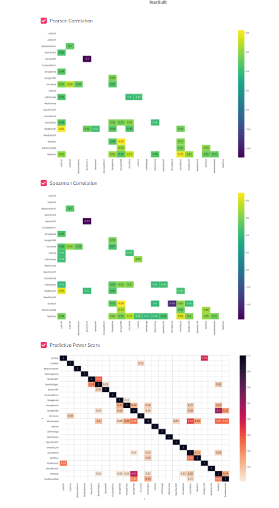

### Page 3
### Estimate House Price
This page answers business requirement 2:

- A house price estimator is present for the dashboard user to amend the figures accordingly and thus generate house price estimations. 
- The 5 widgets available to toggle the data for the 5 variables regarded as most highly correlated to effect house price. 
- House data is available to see, this was supposed to be of the 4 inherited houses only but as I have described in the bug section of the README file, the entire data set file is being pulled instead. Below this is the breakdown of the value of the client’s 4 inherited houses. 

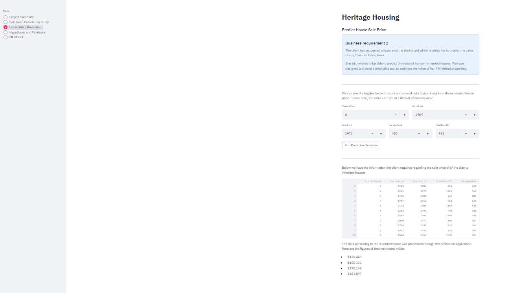

### Page 4
### Hypothesis

This page sets out the 3 statements that were hypothesized at the onset of the project. This page elaborates on the conclusions of the study of data in relation to the initial hypothesis and how they were validated. 
This page confirms all 3 hypotheses as being correct: 
1. The larger the square footage of the property the higher the price
2. The more recent the property build, the higher the property sale price/value
3. The better the overall quality of the property, the higher the price

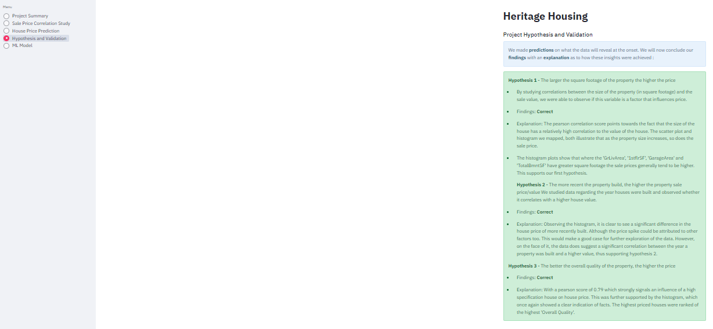

### Page 5
### ML Pipeline
This page answers business requirement 2: 
- Informative conclusion at the top of the page to give the reader a quick insight about what outcome of the steps listed below. 
- ML Pipeline in one place for the reader to understand the steps that were taken. 
- Feature Importance graph that illustrates which features rank as most important and how they stack up next to each other too. 
- Pipeline Performance is presented with various statistics pertaining to the performance of the pipeline, including the R2 Score. 

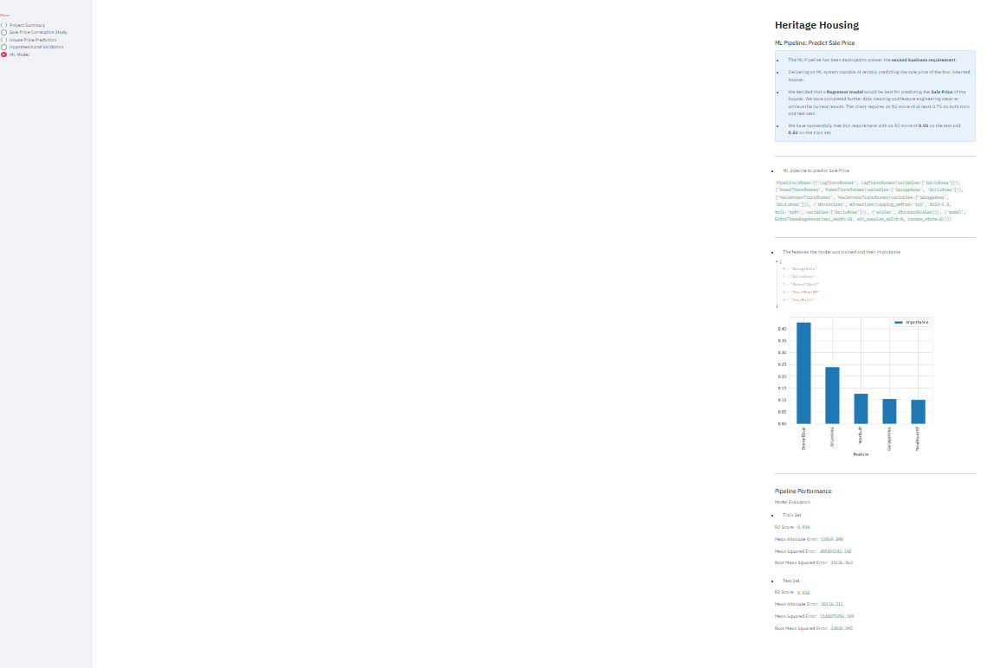
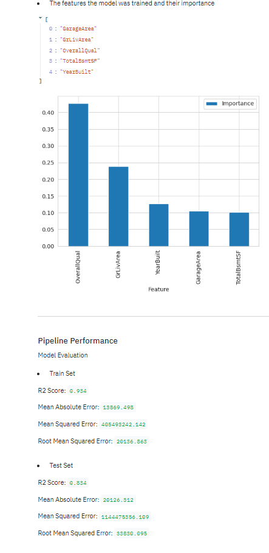

## Unfixed Bugs
### Inherited house dataset

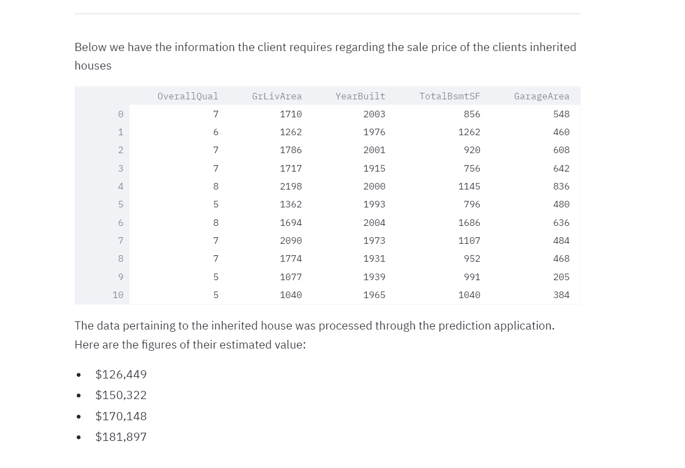
I had a bit of a struggle initially trying to link the Kaggle dataset, however after much trouble shooting and with the help of Neil, I was able to pull through the dataset. I Checked the data, and all seemed well. However, when I developed the 'House Price Prediction' page of the dashboard, I found that the data being pulled through under the inherited houses file was in fact a duplicate of the full dataset. After I had completed the rest of the dashboard, I tried to pull the Kaggle dataset once again to correct this error, but then realised that the steps would have to be repeated with the dataset. This would take some time and there is a possibility of other issue cropping up and this was not a risk I wanted to take. 
This is something I would definitely correct when time permits, however for the time being it seemed sensible to explain what had happened and that I understand what the error is and how it needs to be corrected in the future. 

### Deployment fail 
I had originally successfully deployed the application to via Heroku when I first started creating the dashboard. This was done in the hopes that there will be no issues further down the line when time is of the essence. However, it is sods law that a dependency issue cropped up when I went to check the application via Heroku prior to submission. This happened when there was no tutor support available to help troubleshoot the problem. My mentor, Mo Shami spent a good 45 mins trying to help me with this, however we were unsuccessful. 

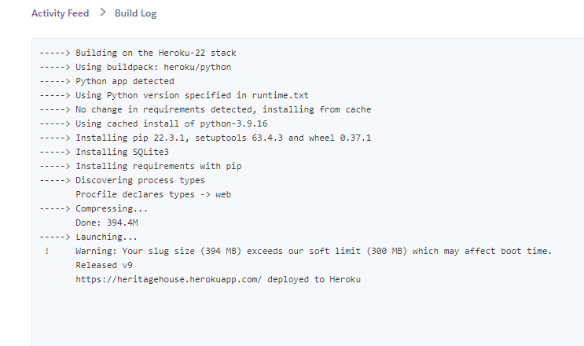

The issue really came down to the incompatibility between NumPy version 1.18.5 and the other packages. I tried changing the version a few times but more compatibility issues with NumPy kept cropping up. I tried version 1.20.0 and version 1.21.5 and I believe 1.21.0 also. I reverted back to the original 1.18.5 version of NumPy as Heroku says the deployment has been successful but upon opening the app there is an error page stating "ModuleNotFoundError: No Module named 'numpy.random.bit_generator'. 

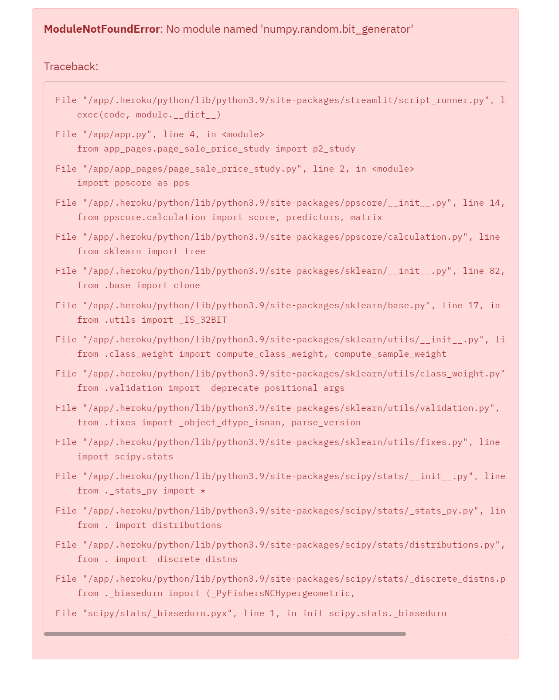

Naturally I did my best to resolve this issue. I was very disappointed that it could not be resolved. This is something I will revisit again in the future, once permitted to ensure that the site is live. 

## Deployment
### Heroku

* The App live link is: https://heritagehouse.herokuapp.com/ 
* The project was deployed to Heroku using the following steps.

1. Log in to Heroku and create an App

2. At the Deploy tab, select GitHub as the deployment method.

3. Select your repository name and click Search. Once it is found, click Connect.

4. Select the branch you want to deploy, then click Deploy Branch.

5. The deployment process should happen smoothly in case all deployment files are fully functional. Click now the button Open App on the top of the page to access your App.

## Main Data Analysis and Machine Learning Libraries

* [Streamlit](https://streamlit.io/)- Framework for creating dashboard.
* [Numpy](https://numpy.org/) - Process arrays to store values 
* [Pandas](https://pandas.pydata.org/) - Data analysis, exploration and visualisation. 
* [pandas_profiling](https://pypi.org/project/pandas-profiling/) - Display data in various formats
* [Feature-engine](https://feature-engine.readthedocs.io/en/latest/) - Engineer pipeline 
* [Scikit-Learn](https://scikit-learn.org/) - Create pipeline and apply algorithms. 
* [matplotlib](https://matplotlib.org/)- Create data visualisations such as plots. 
* [seaborn](https://seaborn.pydata.org/index.html)- Plotting charts for displaying feature importance correlation 

## Technologies used 
* [Github](https://github.com/) - Served as the remote repository
* [Gitpod](https://gitpod.io) - Served as the local repository and IDE.
* [Streamlit](https://docs.streamlit.io/) - To develop and display dashboard
* [Heroku](https://id.heroku.com/) - Site deployed to heroku 

## Languages used
* [Python](https://www.python.org) 

## Refrences
https://pythonguides.com/how-to-find-duplicates-in-python-dataframe/ - Checking for duplicated data  
https://pip.pypa.io/en/stable/topics/dependency-resolution/ - 'Dependency hell', troubleshooting deployment issue. 
https://stackoverflow.com/questions/72157517/error-resolutionimpossible-error-when-deploying-web-application-on-aws-beanstal- Trouble-shooting deployment issue. 
https://discuss.streamlit.io/t/module-not-found-no-module-named-numpy-random-bit-generator/30713 - Trouble-shooting deployment issue

## Credits 

- Kaggle - dataset on which the study was based
- Code Institute - for the learning materials and template for the project
- 
* In this section, you need to reference where you got your content, media and extra help from. It is common practice to use code from other repositories and tutorials, however, it is important to be very specific about these sources to avoid plagiarism. 
* You can break the credits section up into Content and Media, depending on what you have included in your project. 

### Content 
- The template for this repository was provided by [Code Institute](www.codeinstitute.net). 
- The dataset for this project is sourced from [Kaggle](www.kaggle.com)
- The [template](https://github.com/Code-Institute-Solutions/milestone-project-heritage-housing-issues) for this project was provided by Code Institute. 
- The custom functions or code which was taken from the Code Institute resources have been stated in the notebooks/app pages in markdown format or commented out. 

## Acknowledgements 
* I would like to thank Neil McEwen of Code Institute for his patience and assistance with my many queries on slack
* I would like to thank my mentor; Mo Shami for his guidance. 
* Finally a thank you to my husband for being patient, understanding and supportive throughout this project. 
